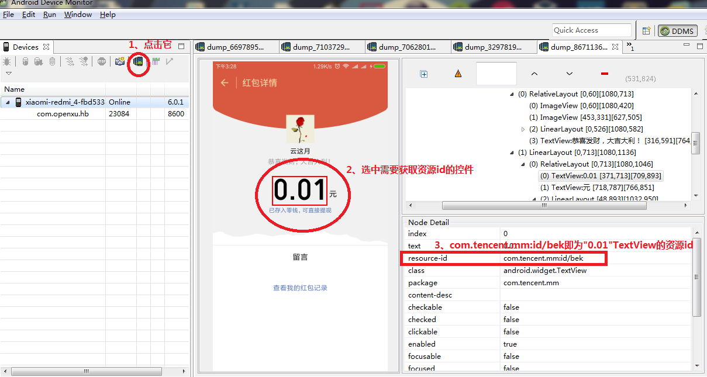

# WXhongbao
微信自动抢红包插件，支持锁屏（无密保）聊天界面等各种情况

不同微信版本插件apk下载地址： 
[6.5.3版本.apk](https://github.com/openXu/WChatHB/blob/master/6.5.3%E7%89%88%E6%9C%AC.apk)
[6.5.4版本.apk](https://github.com/openXu/WChatHB/blob/master/6.5.4%E7%89%88%E6%9C%AC.apk)

##优势 ：
> 1.可以在聊天界面自动强不依赖于通知栏推送
2.可以在屏幕熄灭的时候的时候点亮屏幕自动抢（没有设置屏保的情况下）

##效果：

##注意：
> 1.微信不同版本的资源id不同，在AirAccessibilityService中需要修改对应版本“开”按钮的资源id，否则不能自动点开红包
2.“开”按钮的资源id可通过Tools-->Android-->Android Device Monitor 

如下图：

 

